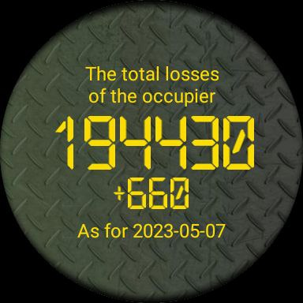

# RWGFY



This project is a tile for Wear OS that shows everyday losses of RF AF (aka occupiers).

Data is fetched from API: https://russianwarship.rip/ 

It attempts to refresh itself everyday in 8am (GMT+2) with 15 minutes retry.

Future releases will show more stats (like loses of tanks and artillery).

## Building project

Before building project run
```shell
./gradlew openApiGenerate
```

Then run as usual using Android Studio.